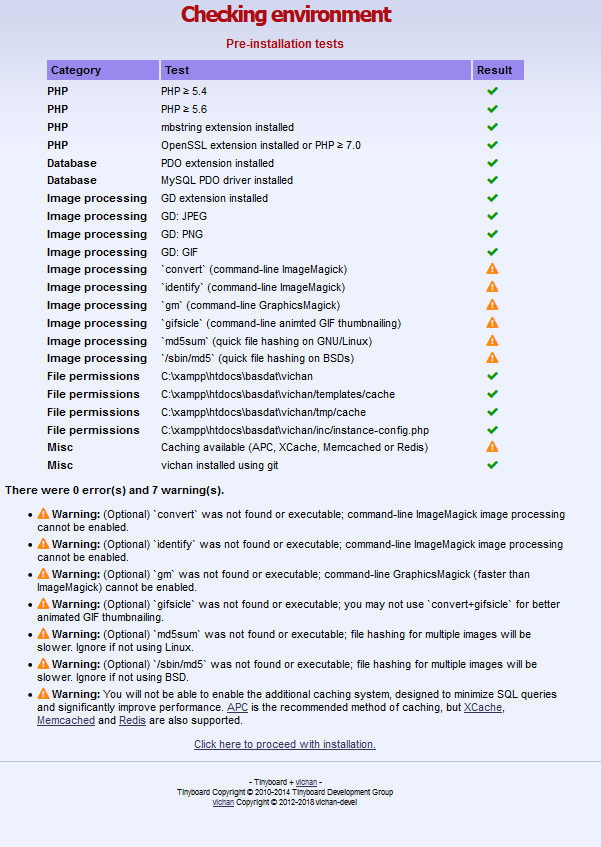
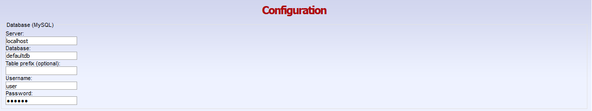
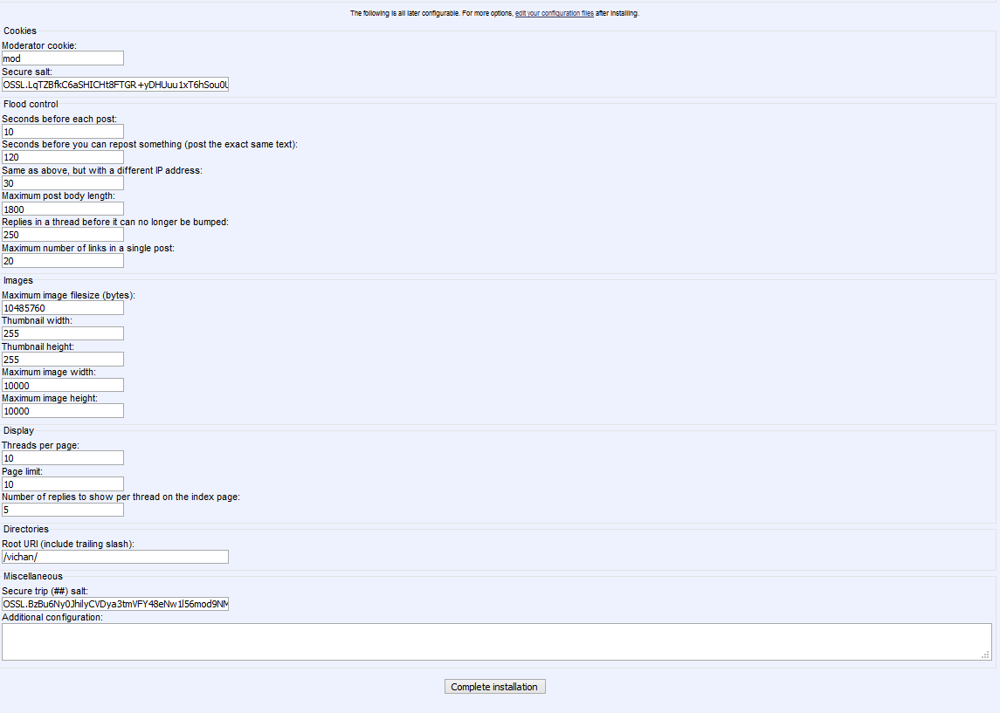
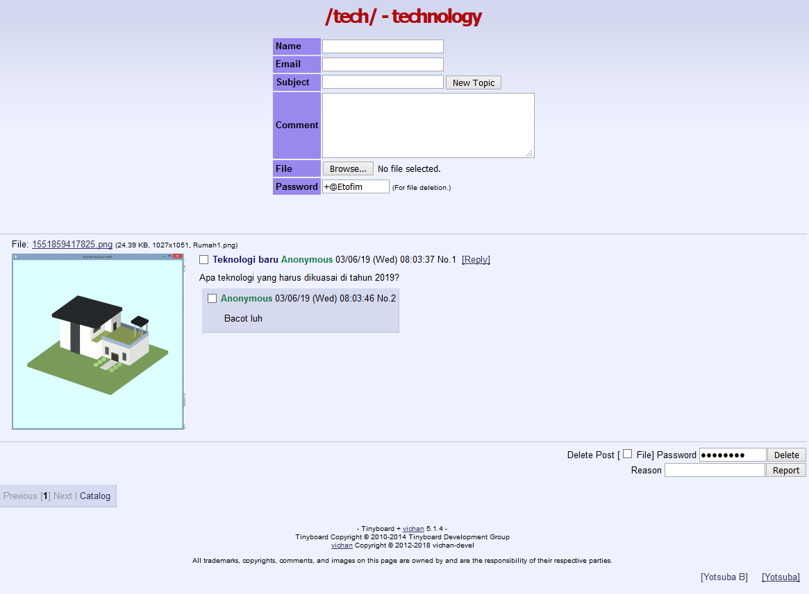

[Sekilas Tentang](#sekilas-tentang) | [Instalasi](#instalasi) | [Cara Pemakaian](#cara-pemakaian) | [Pembahasan](#pembahasan) | [Referensi](#referensi)
:---:|:---:|:---:|:---:|:---:|:---:|:---:


# Sekilas Tentang
[`^ kembali ke atas ^`](#)

**vichan** adalah sebuah paket perangkat lunak yang ringan, cepat, dan mudah untuk dikonfigurasi. Perangkat lunak ini dibuat dengan menggunakan bahasa pemrograman `PHP` dan memiliki beberapa dependensi


# Instalasi
[`^ kembali ke atas ^`](#)

Pada proses instalasi, kelompok kami menfaatkan docker untuk melakukan hosting.

#### Kebutuhan Sistem :
- Sistem operasi Linux atau FreeBSD
- Apache Web server 1.3+
- PHP 5.4+
- MySQL 5.0+
- Docker

#### Proses Instalasi :
0. Clone repository vichan ke folder DocumentRoot
   ```
   $ git clone https://github.com/vichan-devel/vichan/
   ```
1. Membuat file docker-compose.yml
    ```
    version: '3'
    services:
        php-apache:
            build:
                context: ./php-apache
            ports:
                - 8000:80
            volumes:
                - ./DocumentRoot:/var/www/html
                - ./phpconfig:/usr/local/etc/php
            links:
                - 'mariadb'
        mariadb:
            image: mariadb:10.1
            volumes:
                - mariadb:/var/lib/mysql
            environment:
                TZ: 'Asia/Jakarta'
                MYSQL_ALLOW_EMPTY_PASSWORD: 'no'
                MYSQL_ROOT_PASSWORD: 'root'
                MYSQL_USER: 'user'
                MYSQL_PASSWORD: 'secret'
                MYSQL_DATABASE: 'defaultdb'
            ports:
                - 13306:3306

    volumes:
        mariadb:
    ```

2. Buat php-apache/Dockerfile
    ```
    FROM php:7.2.1-apache

    RUN apt-get update && \
        apt-get install -y -qq git \
            libwebp-dev \
            libgif-dev \
            libjpeg62-turbo-dev \
            libpng-dev libxpm-dev \
            apt-transport-https \
            libfreetype6-dev \
            libmcrypt-dev \
            libssl-dev \
            zip unzip \
            nano

    RUN pecl install redis && docker-php-ext-enable redis
    RUN docker-php-ext-configure gd --with-freetype-dir=/usr/include/ --with-jpeg-dir=/usr/include/ --with-webp-dir --with-png-dir --with-gif-dir
    RUN docker-php-ext-install -j$(nproc) zip pdo pdo_mysql gd bcmath mbstring
    RUN chmod -R 777 . 

    RUN for mod in rewrite headers; do a2enmod $mod; done && service apache2 restart
    ```

3. Buat phpconfig/php.ini
    ```
    date.timezone = "Asia/Jakarta"
    extension_dir=/usr/local/lib/php/extensions/no-debug-non-zts-20170718
    extension=gd.so
    extension=pdo.so
    extension=pdo_mysql.so
    ```

4. Build container dengan docker-compose
    ```
    $ docker-compose up
    ```
    
5. Buat database dan user pada docker yang dibuat
    ```
    $ docker exec -it dockerized-lamp_mariadb_1 bash
    $ mysql -u root -p
    mysql > CREATE USER 'user'@'localhost' IDENTIFIED BY 'secret';
    mysql > CREATE DATABASE defaultdb;
    mysql > GRANT ALL PRIVILEGES ON defaultdb . * TO ‘user’@'localhost';
    mysql > FLUSH PRIVILEGES;
    ```

7. Access install.php pada ip yang telah dibuat docker
    <h1 align="center"></h1>

8. Masuk ke tahap pengecekan dependensi yang dibutuhkan, pastikan tidak ada error
    <h1 align="center"></h1>

9. Isikan informasi database yang telah dibuat
    <h1 align="center"></h1>

10. Konfigurasi imageboard, bisa dilakukan nanti, selesaikan konfigurasi
    <h1 align="center"></h1>

# Cara Pemakaian
[`^ kembali ke atas ^`](#)

Cara pemakaian **vichan** ini terbilang mudah sama seperti penggunaan jenis imageboard lainnya. Kita dapat membuat thread atau membalas thread dengan reply.

<h1 align="center"></h1>

# Konfigurasi
[`^ kembali ke atas ^`](#)

### File Konfigurasi

Vichan dibentuk dari beberapa file konfigurasi:

- inc/config.php -- Berisi nilai default, jangan rubah file ini.
- inc/instance-config.php -- Tulis semua konfigurasi global disini.
- (board)/config.php -- Konfigurasi spesifik untuk suatu board.

Syntax yang digunakan untuk inc/instance-config.php dan (board)/config.php sama persis dengan yang digunakan inc/config.php. Untuk membuat suatu konfigurasi cukup salin baris kode yang ingin dirubah dari inc/config.php lalu rubah nilai nya.

### Urutan Loading

- inc/config.php -- config akan direset ke nilai default.
- inc/instance-config -- beberapa config default akan ditimpa dengan nilai yang ada di file ini.
- (board)/config.php -- nilai yang ada di file ini akan menimpa nilai config yang ada sebelumnya.


# Pembahasan
[`^ kembali ke atas ^`](#)

**vichan** dibuat dalam bahasa pemrograman `PHP` yang support untuk penggunaan MySQL. Sebagai salah satu imageboard yang paling banyak digunakan di dunia, aplikasi ini menawarkan berbagai kelebihan, diantaranya :
- Aplikasi ini memiliki panel admin yang dapat diakses di mod.php
- Panel administrasi simple dan mudah digunakan
- Ringan dan Sederhana
- Memiliki dependensi yang sedikit
- Mimiliki fitur tambahan yakni spamfilter untuk memfilter spam
- Banyak pengguna yang berkontribusi pada *discussion boards* dan sejenisnya, sehingga masalah yang dihadapi pengguna dapat cepat terselesaikan.

Tentu saja, sebuah aplikasi pasti memiliki kekurangan. Kekurangan yang dimiliki **vichan** antara lain :
- Tidak ada page khusus dashboard user, jadi user tidak dapat mengetahui board apa saja yang tersedia
- Hanya support database MySQL

Jika dibandingkan dengan imageboard sejenisnya, imageboard ini memiliki beberapa keunggulan dan kelemahan. Berikut adalah beberapa perbandingan antara kedua imageboard ini :
- **vichan** tidak menampilkan iklan
- **vichan** tidak memiliki captcha
- imageboard lain memilki dashboard untuk user
- **vichan** hanya menyediakan 2 tema


# Referensi
[`^ kembali ke atas ^`](#)

1. [Vichan github](https://github.com/vichan-devel/vichan/) - PrestaShop
